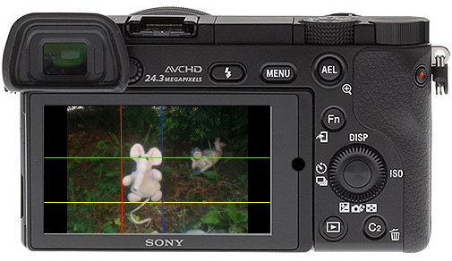

# Sony-PMCA-SubjectBoundarySetter

A Sony Alpha series camera application that lets you set boundary lines of a subject to better and quicker setup your scene for recurring and/or time lapse based shootings.

## What does the application do?

1. You are able to select a picture from the ones you already created

2. then by pressing the TOP, BOTTOM, LEFT, or RIGHT side of the *front dial wheel*, you can activate the different, colored vertical or horizontal lines, 

3. which after you can turn the *front dial wheel* clock or anti-clockwise so that you are able to move the active/selected line to a specific and desired position on the selected picture. That way you can set boundary lines of a subject of your interest and keep it recorded.

4. After that pressing the ENTER key - the middle part of the *front dial wheel* - you can activate the camera preview along with the pre-recorded subject boundary lines, and set your real subject aligned with the boundary lines. 

This tiny app can be very helpful if you want to make recurring pictures from the same subject in a way that the subject will be always in the same part with almost the same angles in the taken pictures.

A sample usage can be when you create a time-lapse movie from the many input still pictures. Such a showcase is to show the change of the body day-by-day, during e.g. a pregnancy, or a training program. For this the best pictures can be taken from a tripod: 
- always set your tripod to the exact same height
- let both the subject and the tripod placed on the same flat surface
- use this tiny application, and match the alignment of the boundary lines with the real subject either by moving the subject or the tripod

That way you can ensure approximately the same axonometric angles with the same dimensions of the subject on each and every picture.

Enjoy, glad to hear back your feedback and how it works for you: Petusa / peter.x.nagy@gmail.com
